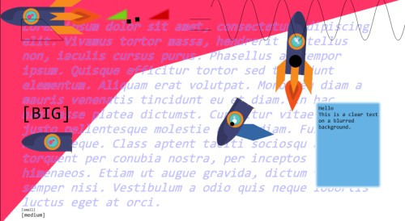

# Elm-regl

Elm bindings for [regl](https://github.com/regl-project/regl).

Aims to provide a set of declarative APIs to use WebGL in Elm through regl.
Users don't need to worry about the low-level implementation but are able to write custom effects using shaders.




## Usage

You can learn how to use Elm-regl in the following ways:

- See the examples in [test](./test).
- Read the API docs.

## Example Usage

```elm
REGL.group [ REGL.crt 50 ]
    [ REGL.clear (Color.rgba 1 1 1 1)
    , REGL.textbox ( 0, 1050 ) 100 ("hello :)" "arial"
    , REGL.quad ( 0, 0 ) ( 1920, 0 ) ( 1920 / 3, 1080 / 3 ) ( 0, 1080 ) (Color.rgba 1 0.2 0.4 1)
    , REGL.group [ REGL.blur 1 ]
        [ REGL.clear (Color.rgba 1 0.2 0.4 0)
        , REGL.triangle ( 700, 100 ) ( 700 + 100, 100 ) ( 700 + 100, 100 / 2 ) Color.red
        , REGL.triangle ( 500, 100 ) ( 500 + 100, 100 ) ( 500 + 100, 100 / 2 ) Color.green
        ]
    , REGL.poly
        [ ( 1100, 600 )
        , ( 1100, 650 )
        , ( 1200, 680 )
        , ( 1300, 650 )
        , ( 1200, 600 )
        ]
        Color.blue
    , REGL.texture ( 0, 0 ) ( 600, 0 ) ( 600, 300 ) ( 0, 300 ) "enemy"
```

`REGL.group` is similar to `group` in `Elm-Canvas`.
It groups a list of `Renderable`s into one. `Renderable` is a drawing command. Elm-regl provides several basic drawing commands like triangles, circles, etc.
Unlike Elm Canvas, Elm-regl provides higher flexibility for one to operate on `Renderable`s.

First, every `Effect` (similar to `Setting` in Elm-Canvas) is a shader that could be parameterized or customized by the users.

Second, users could use `Compositor`s, e.g.,

```elm
REGL.Compositors.imgFade "mask" t renderable1 renderable2
```

to composite two groups of `Renderable`s. Users also could write custom compositors through the GLSL shader language.
