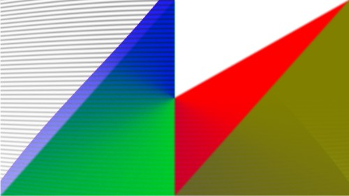

# Elm-regl

Elm bindings for [regl](https://github.com/regl-project/regl).

Aims to provide a set of declarative APIs to use WebGL in Elm through regl.
Users don't need to worry about the low-level implementation but can write flexible, powerful effects using shaders efficiently.





## Usage

You can learn how to use Elm-regl in the following ways:

- See the examples in [test](./test).
- Read the API docs.

### Steup

HTML:

```html
<!DOCTYPE HTML>
<html>

<head>
    <meta charset="UTF-8">
    <title>Elm</title>
    <script type="text/javascript" src="Main.js"></script>
    <script type="text/javascript" src="https://cdn.jsdelivr.net/npm/elm-regl-js@1.2.1/dist/regl.js"></script>
    <link rel="stylesheet" href="style.css">
</head>

<body oncontextmenu="return false;">
    <div id="myapp"></div>
</body>

<script type="text/javascript">
    var app = Elm.Main.init({
        node: document.getElementById('myapp')
    });
    if (app.ports.setView) {
        app.ports.setView.subscribe(function (v) {
            ElmREGL.setView(v);
        });
    }
    if (app.ports.execREGLCmd) {
        app.ports.execREGLCmd.subscribe(function (v) {
            ElmREGL.execCmd(v);
        });
    }
    const canvas = document.getElementById('elm-regl-canvas');
    ElmREGL.init(canvas, app, []);
</script>
</html>
```

Note. Change `Main` to your top-level module.

A basic elm module:

```elm
port module Basic exposing (..)

import Browser
import Color
import Html exposing (..)
import Html.Attributes exposing (..)
import Html.Events exposing (..)
import REGL exposing (REGLStartConfig, startREGL, toHtmlWith)
import String exposing (fromInt)


port setView : Encode.Value -> Cmd msg


port execREGLCmd : Encode.Value -> Cmd msg


port recvREGLCmd : (Encode.Value -> msg) -> Sub msg


port reglupdate : (Float -> msg) -> Sub msg


main : Program () Model Msg
main =
    Browser.element
        { init = init
        , view = view
        , update = update
        , subscriptions = subscriptions
        }


type alias Model =
    {}


init : () -> ( Model, Cmd Msg )
init _ =
    ( {}
    , Cmd.batch
        (batchExec execREGLCmd
            [ startREGL (REGLStartConfig 1920 1080 5 Nothing)
            ]
        )
    )


type Msg
    = Tick Float
    | REGLRecv Encode.Value


update : Msg -> Model -> ( Model, Cmd Msg )
update msg model =
    (model, Cmd.none)

subscriptions : Model -> Sub Msg
subscriptions _ =
    Sub.batch
        [ reglupdate Tick
        , recvREGLCmd REGLRecv
        ]


view : Model -> Html Msg
view _ =
    toHtmlWith { width = 1280, height = 720 }
        [ style "left" "0px"
        , style "top" "0px"
        , style "position" "fixed"
        ]
```

Check examples in `test` to see how to render!

### Example Usage

```elm
REGL.group [ REGL.crt 50 ]
    [ REGL.clear (Color.rgba 1 1 1 1)
    , REGL.textbox ( 0, 1050 ) 100 ("hello :)" "arial"
    , REGL.quad ( 0, 0 ) ( 1920, 0 ) ( 1920 / 3, 1080 / 3 ) ( 0, 1080 ) (Color.rgba 1 0.2 0.4 1)
    , REGL.group [ REGL.blur 1 ]
        [ REGL.clear (Color.rgba 1 0.2 0.4 0)
        , REGL.triangle ( 700, 100 ) ( 700 + 100, 100 ) ( 700 + 100, 100 / 2 ) Color.red
        , REGL.triangle ( 500, 100 ) ( 500 + 100, 100 ) ( 500 + 100, 100 / 2 ) Color.green
        ]
    , REGL.poly
        [ ( 1100, 600 )
        , ( 1100, 650 )
        , ( 1200, 680 )
        , ( 1300, 650 )
        , ( 1200, 600 )
        ]
        Color.blue
    , REGL.texture ( 0, 0 ) ( 600, 0 ) ( 600, 300 ) ( 0, 300 ) "enemy"
```

`REGL.group` is similar to `group` in `Elm-Canvas`.
It groups a list of `Renderable`s into one. `Renderable` is a drawing command. Elm-regl provides several basic drawing commands like triangles, circles, etc.
Unlike Elm Canvas, Elm-regl provides higher flexibility for one to operate on `Renderable`s.

First, every `Effect` (similar to `Setting` in Elm-Canvas) is a shader that could be parameterized or customized by the users.

Second, users could use `Compositor`s, e.g.,

```elm
REGL.Compositors.imgFade "mask" t renderable1 renderable2
```

to composite two groups of `Renderable`s. Users also could write custom compositors through the GLSL shader language.

## Special Features

- Use Framebuffer Objects (**FBO**) to draw.
- Use Multi-channel Signed Distance Field (**MSDF**) to render text.
- Efficient port implementation in JS.

The corresponding JS port is at [elm-regl-js](https://github.com/linsyking/elm-regl-js).
